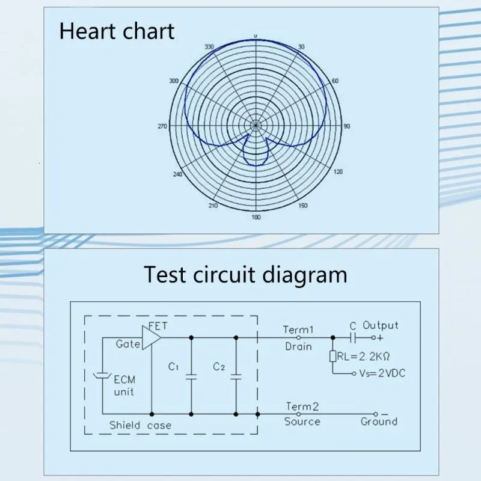
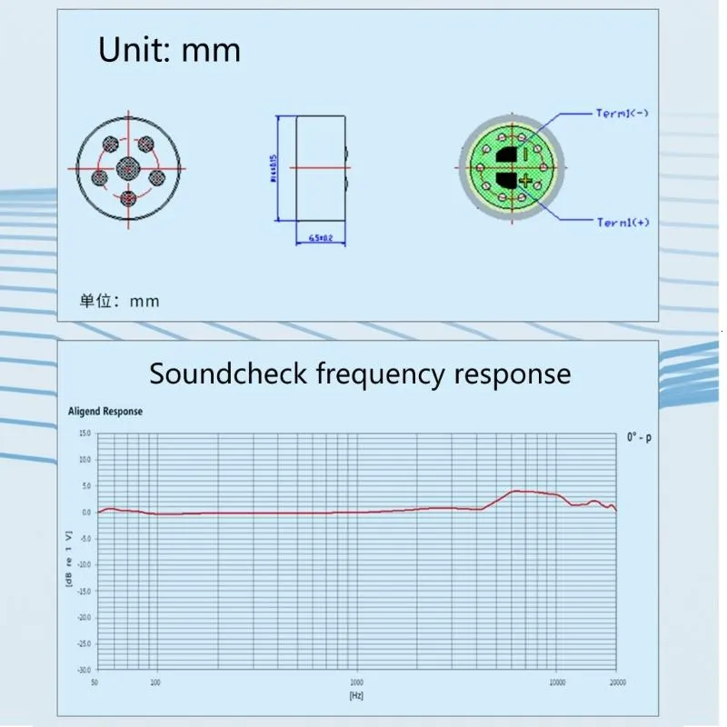

# Unidirectional mic (ECM)

## 1. Introduction

This product is a **Unidirectional Electret Condenser Microphone (ECM)** capsule, suitable for:

- Online meetings, voice recording, presentations.
- Embedded circuit design, R&D, and audio signal processing studies.

**Important Note**: The capsule itself only contains an **ECM element and an internal FET buffer**.  
To capture usable audio levels, you must add an **operational amplifier preamp circuit** to boost the output signal.

---

## 2. Technical Specifications

<div style="display: flex; justify-content: space-between;">

  <figure style="text-align: center;">
    
    <figcaption><em>Figure 1: ECM Block Diagram</em></figcaption>
  </figure>

  <figure style="text-align: center;">
    
    <figcaption><em>Figure 2: Frequency Response Diagram</em></figcaption>
  </figure>

</div>

| Parameter           | Typical Value                       | Notes                      |
| ------------------- | ----------------------------------- | -------------------------- |
| Type                | ECM (Electret Condenser Microphone) | Capsule type               |
| Directivity         | Cardioid (Unidirectional)           | Front-focused pickup       |
| Operating Voltage   | 2V – 10V DC                         | Provided via bias resistor |
| Current Consumption | ~0.3 mA                             | Very low                   |
| Output Impedance    | ≤ 2.2 kΩ                            | Buffered by FET            |
| Sensitivity         | -44 dB (±3 dB) @ 1 kHz              |                            |
| Frequency Response  | 100 Hz – 16 kHz                     | Optimized for voice        |
| Dimensions          | Ø 6.0 × 5.0 mm (typical)            | Depends on model           |

---

## 3. Functional Block Diagram

```
Sound → Electret diaphragm → Charge variation → FET buffer → (Signal in mV)
                                                        ↓
                                       [REQUIRED] Operational Amplifier Preamp
                                                        ↓
                                       ADC / Sound Card / Speaker / DSP
```

---

## 4. External Circuit Requirements

- **Bias Resistor**: 2.2kΩ – 10kΩ from Vcc to microphone.
- **Bias Voltage**: 2 – 10V DC.
- **Op-Amp Preamp**: Required to boost the signal from mV → ~1Vpp.
- **Noise Filtering**: Bypass capacitor (0.1µF – 1µF) between Vcc and GND.

Basic connection example:

```
 Vcc (5V)
   │
   Rbias (2.2kΩ – 4.7kΩ)
   │
   ●───► Signal Out (ECM Mic Output, mV level)
   │
  ECM
   │
  GND
```

Signal must go through **op-amp preamp** before feeding into ADC or amplifier.

---

## 5. Applications

- Conference and desktop microphones.
- Voice recording, podcasting, speech capture.
- Audio front-end for embedded MCUs (STM32, ESP32, Arduino...).
- Voice trigger and sound recognition systems.

---

## 6. Additional Notes

- The product includes only **ECM + FET buffer**.
- To record usable audio, you must add an **op-amp microphone preamp**.
- Direct connection ECM → ADC will result in a too-weak signal.

## [Link of product](https://www.lazada.vn/products/do-nhay-cao-micro-tu-dien-don-unidirectional-mic-loi-cho-cuoc-hop-chuyen-nghiep-ghi-am-i3084064484-s14804458113.html?from_gmc=1&fl_tag=1&exlaz=d_1:mm_150041241_51203484_2010253495::12:22977087039!185688984620!!!pla-295818637131!c!295818637131!14804458113!436766475&gad_campaignid=22977087039)
